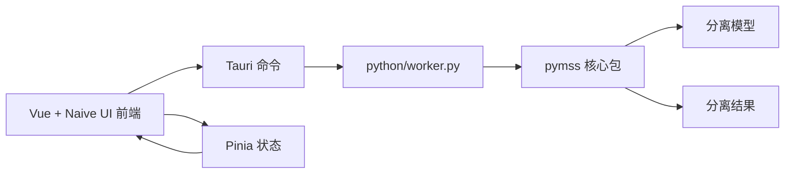

<!-- markdownlint-disable MD013 MD033 MD041 -->

<p align="center">
  
</p>

<h1 align="center">Pymss Studio</h1>

<p align="center">
  面向音乐源分离的精致桌面工作台：模型管理、批量任务、结果归档与分轨编辑一体化。
</p>

<p align="center">
  
  
  
</p>

<p align="center">
  <a href="./README.md">English</a>
  ·
  <a href="https://github.com/pymss-project/pymss-studio/releases">下载安装</a>
  ·
  <a href="https://github.com/pymss-project/pymss">pymss 核心项目</a>
</p>

<p align="center">
  
  
  
  
</p>

<p align="center">
  
</p>

## 项目定位

Pymss Studio 将 [`pymss`](https://github.com/pymss-project/pymss) 音乐源分离能力包装成完整的桌面产品。它为音乐制作、音频处理、模型实验和批量分离场景提供统一入口：准备模型、导入音频、跟踪任务、查看结果，并在编辑器中继续整理和导出分轨。

> 本仓库是桌面应用层。核心分离算法、模型行为与推理细节来自外部 `pymss` 包；本项目负责前端体验、Tauri 桌面集成、Python worker 调度和发布打包。

## 下载安装

> [!WARNING]
> Pymss Studio 仍处于功能开发的早期阶段，正在积极迭代中。请谨慎使用。在此阶段，各版本之间可能存在**破坏性变更**（breaking changes）。

请从 [Pymss Studio Releases](https://github.com/pymss-project/pymss-studio/releases) 下载最新的 Windows、Linux 或 macOS 安装包。

请根据设备选择对应版本：

| 使用场景 | 推荐版本 |
| --- | --- |
| NVIDIA 显卡 | Windows CUDA |
| 没有独立显卡、只有核显，或希望直接使用 CPU 推理 | Windows CPU |
| 网络稳定且希望下载体积尽可能小 | Windows Online |
| Windows 11 受支持的 AMD 显卡 | Windows ROCm |
| Apple Silicon Mac，即 M1/M2/M3/M4 等 | macOS MLX |
| Intel Mac | 当前没有对应发布版本 |

### 命令行（pymss CLI）

Windows 和 macOS 安装包在打包工具目录（`bin/`）里附带 `pymss` 桥接脚本。它在上游
[pymss CLI](https://github.com/pymss-project/pymss) 的基础上，把命令运行在应用托管的环境里，
并复用应用的模型缓存——GUI 下载过的模型 CLI 直接可用：

```bash
# Windows (cmd)：   <安装目录>\bin\pymss.cmd separate --input song.wav
# macOS（终端）：    "/Applications/Pymss Studio.app/Contents/Resources/bin/pymss" --help
```

把 `bin/` 加入 PATH 即可直接使用 `pymss` 命令。桥接脚本在每次调用时动态解析当前环境，
切换或重装 backend 不会导致命令失效。

macOS 版本安装完成后，需要执行：

```bash
xattr -cr '/Applications/Pymss Studio.app'
```

然后从 `/Applications` 打开 Pymss Studio。

## 交流与反馈

Beta 测试、Bug 反馈和用户交流，可以加入 QQ 群：[Pymss Studio 测试交流群](https://qm.qq.com/q/YLLou4NucE)。

## 优点

Pymss Studio 的目标是让更多设备获得更顺畅的桌面分离体验：

- 更快的推理流程：围绕 `pymss` 提供封装好的桌面运行时。
- 更低的内存占用：更适合日常分离和批量任务。
- 更多平台通用：覆盖 Windows、Linux、macOS。

## 界面预览

| 浅色主题 | 深色主题 |
| --- | --- |
|  |  |

## 核心能力

| 模块 | 能力 |
| --- | --- |
| 工作台 | 展示运行环境、本地模型、进行中任务、分离结果和推荐流程。 |
| 分离配置 | 导入音频/视频文件或文件夹，选择已下载模型，配置输出格式、运行设备、TTA、调试日志和高级推理参数。 |
| 任务队列 | 查看排队和执行中的任务，跟踪阶段进度、运行日志，并支持重试、取消和历史清理。 |
| 模型库 | 浏览模型、下载/续传模型文件、删除本地模型，并维护模型存储目录。 |
| 结果与工程 | 管理生成结果和编辑器工程，方便回看、整理与再次编辑。 |
| 分轨编辑器 | 提供波形预览、播放控制、素材面板、混音控制、工程保存、缺失素材重连和导出。 |
| 桌面发布 | 基于 Tauri v2 与 Python worker，支持嵌入式 Python 运行时和多变体发布流程。 |

## 近期计划

- I 卡和 A 卡适配。欢迎拥有 Intel GPU 或 AMD GPU 的开发者加入 `pymss-project`，一起做验证、打包和性能调优。
- 实现 iOS 和 Android 端 GPU 推理。

## 长期计划

- 实现 iOS 和 Android 端 NPU 推理。

## 技术栈

| 层级 | 技术 |
| --- | --- |
| 前端 | Vue 3、TypeScript、Vite、Pinia、Vue Router、Vue I18n、Naive UI |
| 桌面壳 | Tauri v2、Rust、Tauri dialog/shell/store 插件 |
| Worker | `python/worker.py` 中的 JSON 协议 |
| 核心能力 | 外部 [`pymss`](https://github.com/pymss-project/pymss) 包 |
| 打包发布 | pnpm、Tauri CLI、PowerShell 运行时准备脚本、GitHub Actions |

## 开发前准备

- Node.js 与 `pnpm@10.33.2`
- Rust 与 Cargo，用于 Tauri 开发
- Python，用于 worker 开发和本地调试
- 已发布的 `pymss` 包：`python -m pip install pymss`
- `pymss` 核心包所需的平台相关媒体、模型和推理依赖

Python worker 会从当前 Python 环境导入 `pymss`。发布包会将其安装到内置的
Python runtime 中。

## 开发

安装依赖：

```bash
pnpm install
```

只启动前端开发服务器：

```bash
pnpm dev
```

启动完整 Tauri 桌面应用：

```bash
pnpm tauri dev
```

构建前端：

```bash
pnpm build
```

构建生产版桌面应用：

```bash
pnpm tauri build
```

## 环境变量

运行数据统一存放在一个数据根目录下。应用会基于该根目录派生出
`settings/`、`models/`、`outputs/`、`editor-projects/`、`logs/` 和 `temp/`。

数据根目录选择顺序：

1. 设置了 `PYMSS_STUDIO_DATA_ROOT` 时，优先使用它。
2. 开发构建使用项目根目录下的 `./data`。
3. Windows release 构建如果在可执行文件同级存在 `pymss-studio.portable` 标记文件，则使用可执行文件同级的 `data`。
4. 普通安装版 release 构建使用 `~/.pymss-studio`。

| 变量 | 默认值 | 说明 |
| --- | --- | --- |
| `PYMSS_STUDIO_DATA_ROOT` | 见上方说明 | 设置、模型、输出、工程、日志和临时文件的数据根目录。 |
| `PYMSS_STUDIO_PYTHON` | `python` | Tauri 后端启动 worker 时使用的 Python 解释器。 |
| `PYMSS_STUDIO_DEFAULT_OUTPUT_DIR` | 应用默认值 | 分离结果的默认输出目录。 |

## 项目结构

```text
.
├── src/                  # Vue 前端：页面、组件、状态、国际化、编辑器 UI
├── src-tauri/            # Tauri v2 应用、Rust 命令与打包配置
├── python/               # JSON worker 协议与运行时依赖说明
├── scripts/              # 运行时准备、发布暂存、清理脚本
├── installer/            # Windows 安装包相关资源
├── images/               # README 截图
└── package.json          # 前端与 Tauri 命令
```

## 架构



前端负责交互体验与页面状态；Tauri 负责桌面集成、进程调度、文件对话框和资源打包；Python worker 通过 JSON 协议提供模型、环境、音频和推理相关操作，并把真正的分离逻辑交给 `pymss`。

## 发布打包

Windows 发布分为 CUDA 与 CPU 两个变体。发布流程会先准备嵌入式 Python 运行时，再构建 Tauri 可执行文件，随后将 worker、核心项目和工具链暂存到便携目录，最后生成压缩包或安装器。

```powershell
./scripts/prepare-python-runtime.ps1 -Variant cuda
./scripts/prepare-python-runtime.ps1 -Variant default
```

暂存后的构建会通过 `env_info` 和 `list_models` 等 worker 命令做冒烟检查。

## 验证

当前仓库没有独立的自动化测试套件。提交或发布前建议至少执行：

```bash
pnpm build
pnpm tauri build
```

对打包后的 Python 环境，可额外验证：

```bash
python python/worker.py env_info
python python/worker.py list_models
```

## 许可证

Pymss Studio 使用 GNU Affero General Public License v3.0 授权。详见 [LICENSE](./LICENSE)。

## 贡献

有关如何为 Pymss Studio 贡献的详细信息，请参阅 [CONTRIBUTING.md](./CONTRIBUTING.md)。
